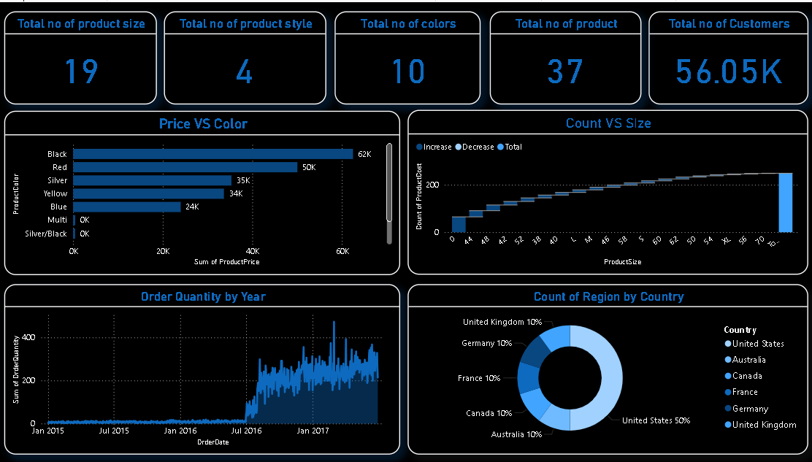
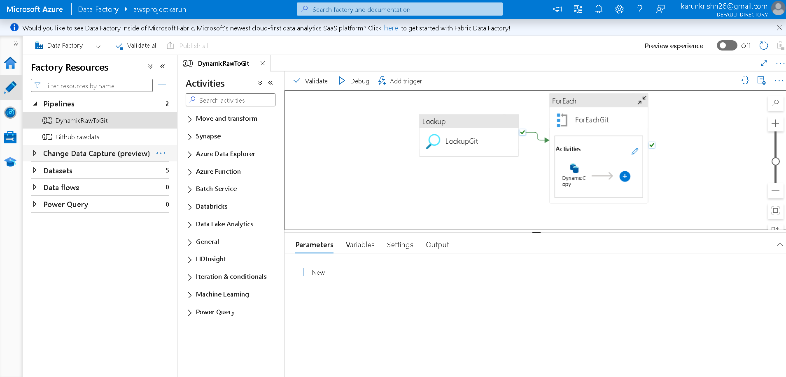
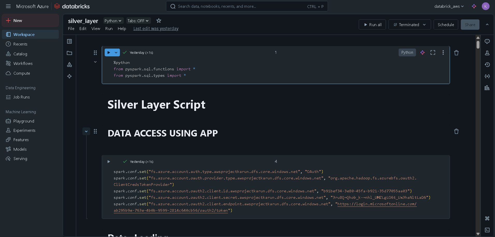

# 🚀 End-to-End Azure Data Lakehouse Project

This project demonstrates a **real-world implementation of a modern data lakehouse architecture** using Microsoft Azure. It simulates a complete data pipeline starting from ingestion, transformation, and analytics — covering both batch and near-real-time use cases.

---

## 📌 Project Highlights

- ✅ Built on **Microsoft Azure Free Tier**
- ✅ Uses **Bronze-Silver-Gold Layered Architecture**
- ✅ Handles **data ingestion**, **ETL**, **transformation**, and **analytics**
- ✅ Implements **real-world data pipeline use cases** for business reporting

---

## 📊 Architecture Diagram



---

## 🏗️ Tech Stack

| Layer          | Tools & Services Used                            |
|----------------|--------------------------------------------------|
| Ingestion      | Azure Data Factory, REST API                     |
| Storage        | Azure Data Lake Gen2                             |
| Transformation | Azure Databricks, PySpark, Apache Spark          |
| Analytics      | Azure Synapse Analytics, T-SQL, Power BI         |
| Security       | Azure Service Principal, Role-Based Access (RBAC)|

---

## 🔄 Data Flow Overview

1. Ingested JSON data from public API using **Azure Data Factory** into Data Lake (Bronze).
2. Cleaned and transformed the data using **Databricks + PySpark** (Silver).
3. Aggregated and structured data stored in **Synapse Analytics** (Gold).
4. Built insightful dashboards using **Power BI**.

---

## 🧩 Screenshots

### 🔸 Azure Data Factory Pipeline


---

### 🔸 Databricks Transformation Notebook (PySpark)


---

### 🔸 Power BI Dashboard Output


---

## 📂 Repository Structure

```bash
azure-data-pipeline-project/
├── data-ingestion-pipeline/     # ADF JSONs 
├── databricks-notebooks/        # PySpark notebooks
├── synapse-scripts/             # External table + Openrowset scripts
├── images/                      # Architecture + screenshots
└── README.md
